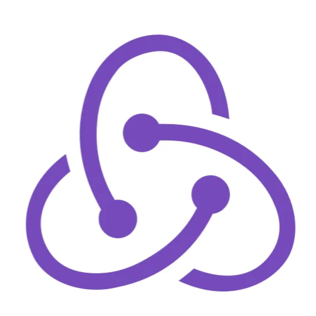

###### <h1 style="text-align: center;"> Github Kanban Board  </h1>

<h2>Project Description:</h2>

The <b>Github Kanban Board</b> project is a web application that allows users to view GitHub issues for a repository as a kanban board. Users can enter the repository URL, load issues, and organize them into three columns: ToDo, In Progress, and Done. The application interacts with the GitHub API to fetch repository issues.

[DEMO LINK](https://ViktorBykh.github.io/github-kanban-board)

<h4>Test Links:</h4>
<h6><code>https://github.com/facebook/react</code></h6>
<h6><code>https://github.com/twbs/bootstrap</code></h6>

<h2>Key Features:</h2>
<ol>
  <li>
    <strong>Repository URL Input:</strong>
    
Users can enter the repository URL in the input field and press "Load" to fetch issues for the repository.

  </li>
  <li>
    <strong>Issue Columns:</strong>
    
The application contains three columns: ToDo, In Progress, and Done, to organize repository issues based on their status.

  </li>
  <li>
    <strong>Drag-n-Drop:</strong>
    
Users can drag-n-drop issues between and within columns to change their status and order.

  </li>
  <li>
    <strong>Persistent State:</strong>
    
The application stores the current issue positions (column and order) between sessions, ensuring that changes made by the user are preserved.

  </li>
  <li>
    <strong>Profile and Repo Links:</strong>
    
Users can visit the profile of the repository owner and navigate to the repository by clicking on links provided under the input field.

  </li>
</ol>

<h2>Technologies:</h2>
<ul>
  <li>
     <b>React</b>
  </li>
  <li>
     <b>Redux</b>
  </li>
  <li>
     <b>Bootstrap</b>
  </li>
  <li>
     <b>JavaScript</b>
  </li>
  <li>
     <b>TypeScript</b>
  </li>
  <li>
     <b>CSS</b>
  </li>
  <li>
    <b>HTML</b>
  </li>
  <li>
     <b>GitHub API</b>
  </li>
</ul>

<h5>Description:</h5>
<ol>
  <li>The application is developed using React with TypeScript for enhanced type safety.</li>
  <li>Ant Design UI library is utilized for building the user interface components, providing a modern and responsive design.</li>
  <li>Redux is employed as the state manager to manage the application's state and handle data flow.</li>
  <li>React Testing Library is used for testing React components, ensuring reliable and robust code.</li>
</ol>

